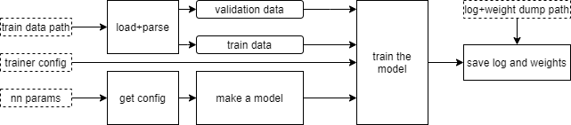

# Task 1

## Problem statement
Implement an approach described in the paper ["Speaker Recognition from Raw Waveform with SincNet"](https://arxiv.org/abs/1808.00158).
Set up experiments and compare the results with those proposed and illustrated in the article.

## Research overview
SincNet is a one-dimensional convolutional neural network (CNN) used for speaker recognition.
Compared to a classical 1-D CNN, SincNet differs in its first layer: convolutional kernels are forced to only sample values from the [sinc function](https://en.wikipedia.org/wiki/Sinc_function), thus such layer is called SincConv.
Such approach may allow to extract more meaningful features than by learning filters with arbitrary values.
More in-depth motivation is outlined in the [report for the Task](report.ipynb).

## Implementation

Required packages:

* Python 3
* PyTorch
* NumPy
* Pandas
* [SoundFile](https://pypi.org/project/SoundFile/)

The SincConv layer with the network architecture are implemented in [model.py](model.py).
Note that the implementation allows the SincConv layer to accept an input with multiple channels, in contrast to the single-channel version proposed in the [original paper](https://arxiv.org/abs/1808.00158).
A model can be fed to the ```train_model``` function in [trainer.py](trainer.py), which also handles dataset split into train and validation parts.
A dataset is loaded by a corresponding loader in [dataloader.py](dataloader.py).
In [main.py](main.py), one can schedule training tasks for various configs defined in [cfg/](cfg/).
Overall pipeline is outlined in [nn_pipeline.pdf](nn_pipeline.pdf):



## Data preparation

TODO
